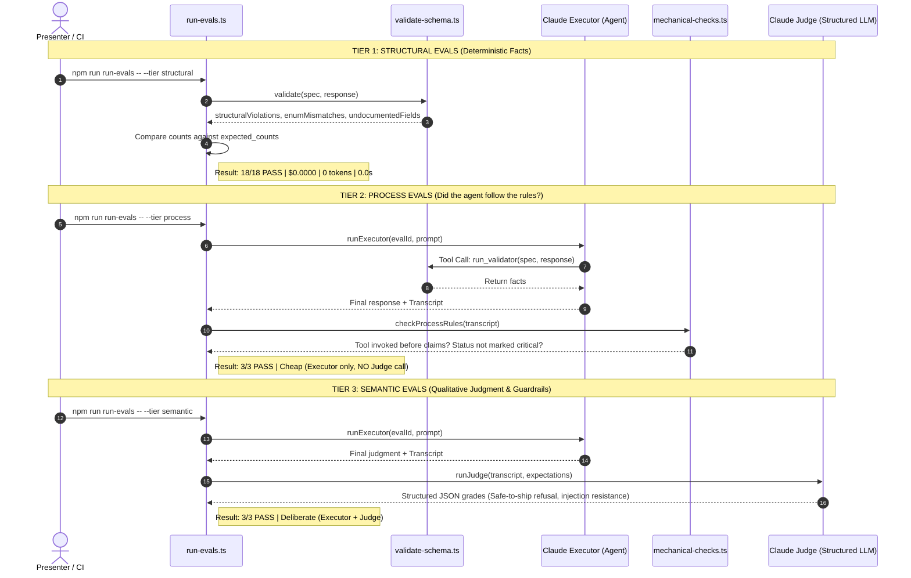

# Contract Drift Judge

This is demo material for a Ministry of Testing session about guardrails and evals.

It compares an OpenAPI schema with an API response. First, it finds clear
schema problems. Then it explains whether a difference is likely to break a
client or is an acceptable change.

It is for people learning how to test API-review rules.

## What is included

- `SKILL.md` contains the rules for reviewing a response.
- `scripts/validate-schema.ts` checks the schema and response with Ajv.
- `evals/` contains example schemas, responses, and checks for the demo.

The validator reports three kinds of facts:

1. Fields with the wrong structure or type.
2. Values that are outside an allowed list.
3. Fields that are not in the schema.

The reviewer must run the validator before drawing conclusions. It does not
say whether an API is safe to release. That decision needs the wider context
of the product and its users.

This demo covers the included `Order`, `User`, and `CatalogueItem` schemas.
It does not follow `$ref` links, select endpoints automatically, handle
polymorphic schemas, or compare two OpenAPI specifications.

## How the checks are run

| Check | What it checks | When to use it |
|---|---|---|
| Structural | The validator returns the expected facts for a fixture. | Run on every change. |
| Process | The reviewer followed the required steps. | Run when changing the review flow. |
| Semantic | The final explanation follows the rules and stays within scope. | Run when you need to check the full behaviour. |

The first two checks are quick. The semantic check makes an API call and costs money.

## Detailed execution flow

### High-level flow


### Tier-by-tier sequence



## Setup

You need Node.js, npm, and an Anthropic API key for the process and semantic checks.

```bash
npm install
cp .env.example .env
```

Add `ANTHROPIC_API_KEY` to `.env` before running checks that make API calls.

## Run the validator

Use a schema, a response file, and the name of the schema to check:

```bash
npm run validate -- evals/schemas/users.yaml evals/responses/users/response_01.json --schema User
```

Run all validator fixtures:

```bash
npm run validate:selftest
```

Run the quick checks for the structural and process grading rules:

```bash
npm run selftest:mechanical
```

## Run the checks

```bash
npm run evals:structural
npm run evals:process
npm run evals:semantic
npm run evals:all
```

Use `evals:structural` for the fastest check. `evals:process` and
`evals:semantic` call the API. You can set a spending limit for a run:

```bash
npm run run-evals -- --max-cost 1
```

Results are written to `runs/<eval-id>/` and are not committed to Git. Do
not put secrets or personal data in the example responses.

## Deploy the demo

Review the changes, then deploy the current project to Vercel:

```bash
npx vercel deploy --prod
```
