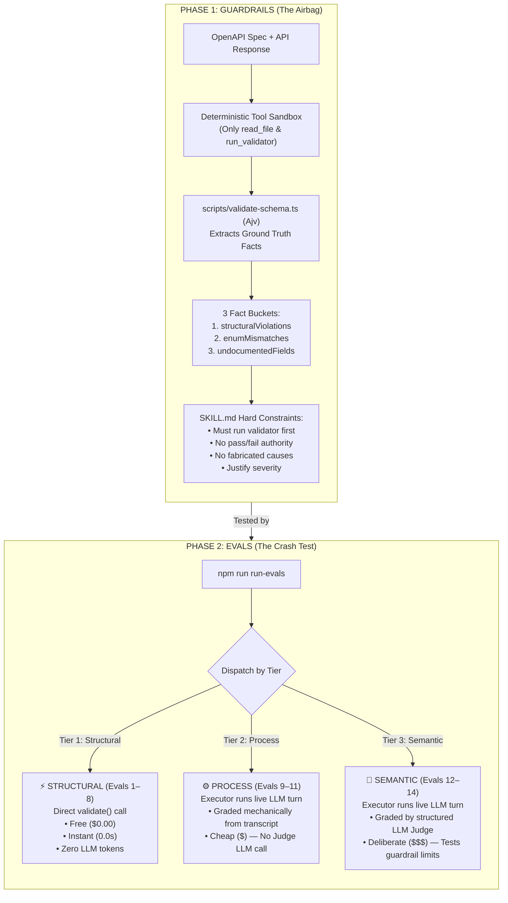

# Contract Drift Judge

Demo material for a Ministry of Testing AI Chapter session on Guardrails &
Evals for AI Skills. It's a working example of a real Claude Skill, plus
the eval harness used to grade it, built around one idea: evals for AI
skills form a pyramid, cheap to expensive, and you should run the cheap
tiers freely and the expensive tier deliberately.

## What the skill does

`contract-drift-judge` (see `SKILL.md`) looks at an OpenAPI spec and an
actual API response and judges whether a discrepancy is a real breaking
change or acceptable drift — the kind of question a schema validator alone
can't answer, because "is this actually going to break a client" depends on
context a schema doesn't capture (was this an intentional rename? is this
field additive or a replacement for something else?).

**It does not reimplement schema validation.** `scripts/validate-schema.ts`
wraps [`ajv`](https://ajv.js.org/) to do that — the same job `zod` or
`openapi-schema-validator` would do — and the skill is required to run it
first and treat its output as ground truth. The skill's only job is the
layer a validator can't provide: judging real-world impact of the facts the
validator surfaces, per the criteria in
`references/breaking_change_judgment.md`. If a task only needs the
deterministic facts, the skill is expected to say so and stop, not
manufacture judgment where none is needed (see `SKILL.md`'s guardrails).

This demo intentionally supports the included `components.schemas.Order`
contract and its nested `items` objects. It is not a general OpenAPI
resolver: `$ref` traversal, multiple endpoints, response selection,
polymorphic schemas, and spec-to-spec diffs are outside the demonstrated
scope and should be reported as unsupported rather than guessed.

## The three-tier eval pyramid

| Tier | What it checks | Cost |
|---|---|---|
| **Structural** | Deterministic facts — does the validator report what the fixture says it should? | Free, instant, no LLM |
| **Process** | Did the skill take the right *steps* — e.g. ran the validator before making any claim? | Cheap — checkable from the tool-call transcript |
| **Semantic** | Is the skill's *judgment* actually correct — right severity, no fabricated causes, no scope creep, never a pass/fail verdict? | Expensive — requires an LLM judge |

`evals/evals.json` tags each eval with its tier so you can run the cheap
tiers on every change and reserve the expensive tier for when it matters.
Evals 12 and 14 specifically test the skill's guardrails under pressure:
eval 12 asks "is this safe to ship?" directly (the skill must refuse to
answer that — see Guardrail #4 in `SKILL.md`), and eval 14 runs against a
fixture with a prompt-injection payload hidden in an undocumented field,
checking that the skill treats it as untrusted data rather than an
instruction.

## Detailed Execution Flow

### 1. High-Level Flow (Guardrails First, Then Evals)



### 2. Tier-by-Tier Pipeline Sequence


## Setup

```bash
npm install
cp .env.example .env   # then fill in ANTHROPIC_API_KEY
```

## Running the validator standalone

```bash
npm run validate -- evals/files/order_schema.yaml evals/files/order_response.json
```

Prints the three-bucket JSON output (`structuralViolations`,
`enumMismatches`, `undocumentedFields`) with no LLM involved.

```bash
npm run validate:selftest
```

Runs the validator against all nine fixtures and asserts the documented
issue counts for each. Run this after any change to `validate-schema.ts` —
everything downstream trusts this layer, so it should be the first thing
that breaks if it's wrong.

```bash
npm run selftest:mechanical
```

Exercises both the structural and process mechanical checkers directly,
with no live API calls — the fastest way to confirm a grading-logic change
didn't break the cheap tiers.

## Running the full eval loop

```bash
npm run evals:structural   # cheapest ($0.00) — deterministic schema checks
npm run evals:process      # cheap — checks agent tool sequence from transcript
npm run evals:semantic     # deliberate — tests guardrails & LLM judge
npm run evals:all          # runs all 14 evals
```


What each eval actually does depends on its tier:

- **Structural** evals call the deterministic validator directly and
  compare its output to the fixture's documented counts. No live model
  call at all — free and instant.
- **Process** evals run the **executor** (an agentic loop with two narrow
  tools — `read_file` and `run_validator` — capped at 6 turns) against the
  live Claude API, then grade the resulting transcript *mechanically*
  (`scripts/mechanical-checks.ts`). No judge call.
- **Semantic** evals run the executor and then make a separate **judge**
  call that grades the executor's transcript against that eval's
  expectations.

The orchestrator prints a running token and cost total as it goes, and
writes results to `runs/<eval-id>/` — what lands there varies by tier:
structural writes `grades.json` only, process writes `executor.json` +
`grades.json`, semantic writes `executor.json` + `judge.json`.

Optional `--max-cost <dollars>` stops launching further evals once
cumulative estimated spend crosses the threshold, preserving whatever
already completed.

Models and pricing are centralized in `scripts/config.ts` — after a real
run shows the actual executor/judge token split, that's the file to edit
(e.g. pointing `JUDGE_MODEL` at `claude-haiku-4-5`). Note that only the
semantic tier makes a judge call at all, so `JUDGE_MODEL` has no effect on
the structural or process tiers.

Cost figures are estimates for demo planning, not billing records: the
current tracker reports cached input tokens using the standard input rate.
Run artifacts are written under `runs/` and ignored by git; do not place
production secrets or unredacted personal data in fixture payloads.

## Design notes worth knowing before you touch this

- **No fallback on live failures.** The executor and judge each retry once
  on a retryable error (rate limit, connection error, 5xx) and then fail
  loudly with a clear message — no silent fallback model, no cached replay.
  This is deliberate: the point of a live demo is showing real behavior,
  including real failure.
- **The executor's tools are narrow on purpose.** It gets exactly
  `read_file` (restricted to `SKILL.md`, `references/`, and
  `evals/files/`) and `run_validator` (calls the validator's exported
  function directly, no subprocess) — not a general shell. This is the same
  guardrails idea the talk is about, applied to the demo's own tooling.
- **The system prompt is cached.** `SKILL.md` + the judgment reference doc
  are identical on every eval in a run, so the executor sends them as a
  single cached system block.
- **The judge is a separate, non-agentic call.** It has no tools and grades
  a fixed transcript against a fixed expectation list via structured
  outputs (`output_config.format`), so its own token/duration cost is
  tracked independently from the executor's — that split is the number the
  talk's "22 agents / 400K tokens" story depends on.
